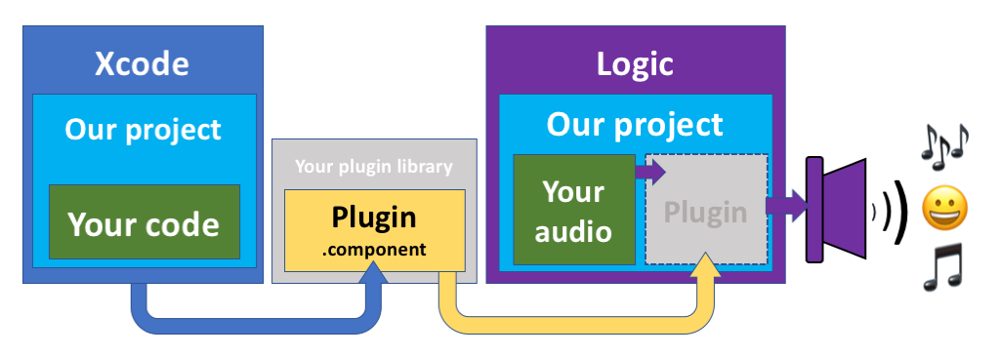
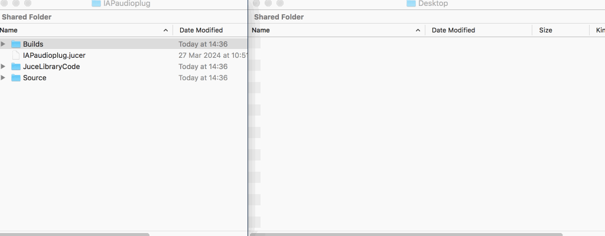

# Workshop 3 – Audio processing

This workshop will introduce audio effect processing. The idea is to record your own audio and/or use the supplied recordings for creative and playful exploration. By the end of this session you should be familiar with: 

1.	Using audio effect plugins as 'insert' effects
2.	Basic signal processing code for gain, panning, distortion, and more
3.	Building and installing audio plugin .components

Some familiarity with Digital Audio Workstations (DAWs) and how audio effects are used on audio tracks/channels is assumed. Step by step instructions are provided, so even if you're not totally familiar with these concepts yet, you can still have fun in this workshop. 😊

## Overview of the puzzle pieces

 

*(reading the diagram from left to right)*

Today we'll use Xcode to build the `IAPAudioPlug` audio plugin `.component`...

...then we'll use **Logic** as a DAW to...

...load the `IAPaudioplug` as an insert effect to...

...process your audio with an audio effect that **you have designed**... 👍

## Getting started

We provide several files as a starting point compatible with the MacOS software on lab machines. All files are zipped for convenient distribution.

1. Download the `IAPAudioPlug.zip` xcode project 
2. Download the `Logic_DAW_Project.zip`

   a. Put this aside for later. We will need it soon, but not initially

## A word of warning

If you accidentally open the supplied Logic DAW project before your plugin is ready, an error message will warn you of a required, missing component.

 

The supplied xcode project and code will build this missing component, allowing you to experiment with simple audio effect processing such as:
* Gain 💪
* Panning 🍳
* Distortion 🎸
* Delay ⏰⏳
* Tremolo ~👋~
* ...and more (if you desire!)!

## Exercise 1 - Build

1. Unzip the `IAPAudioPlug.zip`, navigate to the folder `builds > MacOSX` and load the `IAPAudioPlug.xcodeproj` with xcode.
2. Use the menu to select `Product > Scheme > IAPAudioPlug-ALL`

   * icons for various schemes are different. The desired scheme icon is a dart-board target icon like this 🎯

   * for the curious: different schemes configure different types of plugin technology
   
3. Build the project – await success 🤞

4. Examine the files within the `IAPAudioPlug > builds > MacOSX` folder

   * there should now be a `build -> Debug` folder containing a variety of files

   * focus your attention on the `IAPAudioPlug.component` - confirm the date modified matches **todays date and time**

! a screenshot showing the xcode build folder ] ( ./images/IAPaudioplug_buildfolder.png

## Exercise 2 - Install

On MacOS there are several places one may install an audio plugin component. The most convenient is within your personal 'home' Library folder.
We need to install the `IAPAudioPlug.component` into this 'home' library folder.

1. Use use the finder menu `Go > Go to Folder...`
2. Search for `~/Library/Audio/Plug-ins/Components`

   a. Be **absolutely sure to use the `~` symbol in the search path here**

   b. Finder will not permit you to access the 
   'root' Library folder

   c. The `~` symbol indicates you wish to access your personal 'home' Library folder

   d. Ask a member of staff if you need assistance

4. Copy your `IAPAudioPlug.component` into your personal 'home' Library of audio plugin components.

## The above steps as an animation

The animation below shows the required steps.

However you choose to do it, install the .component to *your personal 'home' plugin library*. You may use `copy` and `paste` menus or drag files using the mouse. 

Later, as we improve and change our plugin, we'll replace old builds with new versions. The end of the animation shows how to confirm you want to replace an old plugin .component with a new version.

## Exercise 3 - Creative exploration!

Congratulations on getting this far. 😀🎉 **The boring parts are over, now begins the fun!**

1. Open the downloaded Logic DAW project
2. Voila! Plugin do the things. Happy fun time exploration yay! 🎶😊🎵

If everything has gone well, you will see the IAPaudioplug controls, similar to the screenshot below.

# Creative prompts

* Play with the plugin to hear what it does to the sound on the timeline
   
   * ...use the provided audio timeline, or delete this and record your own sound with the microphone

   * ...use 'monitoring' mode to hear the effect applied to live microphone input **if you choose this, use headphones to avoid feedback**

* Set the plugin `choiceParam` to different settings to hear the results. 

   * All choices do something different, and there is room for *creative opportunities* and improvements that you can decide below 😊

* Read our helpful code comments provided in the xcode project

   * Focus your attention on the comments in the `PluginProcessor.cpp` file

* Read the guidance in the sections below for further inspiration and guidance

## Gain

In this mode, the starting point code adjusts gain (turns up and down the volume). 

Similarly to the animation below, the `floatParam` value is used as a multiplier. The amplitude of the music 
 is scaled (right the way down to silence if the value is zero) according to the `floatParam` slider value.

Here are some questions to ask yourself:

1. Which part of `PluginProcessor.cpp` does the audio processing code appear?

2. Which part of the code runs when the `choiceParam` is set to `GAIN`?

3. What happens when you adjust the lines which say `*channel... *= stereoGain;` to `*channel... *= 2 * stereoGain;`

   * Remember that there are **two signals**, one for the left channel, one for the right.

   * Remember to rebuild the component and reload the logic project to test your changes 👍

4. Find and **uncomment** the code for a stereo panner effect.

   * When you rebuild and test the plugin, this **should** be stereo panner **BUT ITS NOT**. Can you figure out why? 
   
   * Hint: Why is it not possible hear a stereo-pan for a silent signal?

## Distortion

In this mode, the starting point code distorts the sound according to the slider `floatParam` value.

* Which part of `PluginProcessor.cpp` is the distortion processing code?

* The distortion is **deliberately soft**; is it too weak? how to make it stronger? 

* What happens to the sound when you comment out one of the `if` statements? Can you hear the difference?

## Delay

* Delay -> non-Feedback vs Feedback – differences? Change delay time? 

## Tone

* Tone gen modify`+=` symbols to `*=` for tone vs ring modulation

* Tone gen modify oscillator frequency for tremolo
